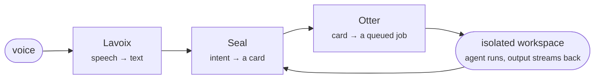

  
  <h3>An agentic lab. We ship a product that runs agents, and the tooling we needed to run it correctly.</h3>
  
<strong><a href="https://unchained-labs.github.io/">unchained-labs.github.io</a></strong>

  

    <a href="https://kymatics.vercel.app">Kymatics</a> ·
    <a href="https://unchained-labs.github.io/graphlint/">graphlint</a> ·
    <a href="https://unchained-labs.github.io/preflight/">preflight</a> ·
    <a href="https://unchained-labs.github.io/decorrelate/">decorrelate</a> ·
    <a href="https://unchained-labs.github.io/authsweep/">authsweep</a> ·
    <a href="https://unchained-labs.github.io/workflow-hub/">workflow-hub</a>
  

  
   Real output, both halves. <a href="https://unchained-labs.github.io/">Every project has a demo on the landing page →</a>

---

Two halves of one bet: **that the useful unit of agent work is a graph, not a
chat.** [Kymatics](#kymatics--the-product) is the product that runs those graphs
for you. [The graph tools](#the-graph-tools) are what we built after running
enough of them to know where it goes wrong.

The second half exists because of the first. Every tool below was written to fix
something we hit shipping Kymatics — and when we pointed them back at our own
stack they found real bugs in the product *and* [two in the scanner
itself](https://github.com/Unchained-Labs/.github/blob/main/docs/kymatics-and-the-graph-tools.md).

## Kymatics — the product

**Speak an intent; get a built thing.** A voice-first pipeline that turns spoken
work into queued agent jobs, runs them in isolated workspaces, and streams the
build back to you live.

| | What it is | Live | Stack |
| :--- | :--- | :--- | :--- |
| **[Kymatics](https://github.com/Unchained-Labs/kymatics)** | The umbrella and the landing page — voice in, structured work out. | [kymatics.vercel.app](https://kymatics.vercel.app) | — |
| **[Otter](https://github.com/Unchained-Labs/otter)** | The orchestration engine. Queues and schedules prompts, runs each in an isolated workspace, streams events, keeps full job history, and reports token usage and cost per job. | [demo](https://otter-psi.vercel.app) | Rust · axum · Postgres · Redis |
| **[Lavoix](https://github.com/Unchained-Labs/lavoix)** | Speech in and out. Provider-based STT/TTS with a FastAPI surface. | [demo](https://lavoix.vercel.app) | Python · FastAPI |
| **[Seal](https://github.com/Unchained-Labs/seal)** | The frontend. A voice-first Kanban over Otter's queue, with live build output and previews. | [demo](https://seal-nine-sigma.vercel.app) | React · TypeScript |

Otter is the interesting part, and it is the reason the rest of this org exists:
once you are running agent jobs by the hundred, *correctness and cost stop being
someone else's problem.*

## The graph tools

Running many agents in parallel is a capability most people now have. Running them
**affordably and correctly** is a systems problem, and it was mostly unbuilt:
nothing priced a workflow before it ran, nothing checked whether verifiers were
independent, nothing linted the spec for the handful of mistakes everyone makes.

| | What it does | Docs | Status |
| :--- | :--- | :--- | :--- |
| **[graphlint](https://github.com/Unchained-Labs/graphlint)** | Static analyzer for agent workflow specs. Catches barrier misuse, correlated verifiers, missing schemas and non-terminating cycles — before a token is spent. 16 rules, SARIF output. | [site](https://unchained-labs.github.io/graphlint/) | `alpha` |
| **[preflight](https://github.com/Unchained-Labs/preflight)** | Prices a workflow before it runs and comments the predicted agent count and dollar cost on the PR that changed it. Dependabot, but for agent spend. | [site](https://unchained-labs.github.io/preflight/) | `alpha` |
| **[decorrelate](https://github.com/Unchained-Labs/decorrelate)** | Measures whether your verifiers are actually independent. Three skeptics sharing a model and a prompt are one check at 3× the price — this puts a number on it. | [site](https://unchained-labs.github.io/decorrelate/) | `alpha` |
| **[authsweep](https://github.com/Unchained-Labs/authsweep)** | Finds route handlers with no authorization check across JS/TS, Python and Rust — Express, Fastify, Koa, FastAPI, Flask, axum, actix-web, rocket. Deterministic, zero tokens, evidence on every finding. | [site](https://unchained-labs.github.io/authsweep/) | `alpha` |
| **[workflow-hub](https://github.com/Unchained-Labs/workflow-hub)** | Six agent workflows worth copying, one per shape. You own the file after it lands. | [site](https://unchained-labs.github.io/workflow-hub/) | `alpha` |
| **[branding](https://github.com/Unchained-Labs/branding)** | The brand system. Measured contrast, computed geometry, tested docs. | [site](https://unchained-labs.github.io/branding/) | `v1` |

Everything is MIT, alpha, and honest about it. Pin exact versions.

### How they fit together

Four stages, and each answers a question you currently cannot answer:

- **Before you write it** — start from a graph that already works.
- **Before you merge it** — does it contain the mistakes everyone makes?
- **Before you run it** — what is this going to cost, and which stage dominates?
- **After you run it** — did the verification you paid for actually buy anything?

The family is self-consistent, and that is enforced rather than claimed:
`authsweep` emits a verify graph that `graphlint` lints clean and `preflight`
prices, and every workflow in `workflow-hub` passes `graphlint` with zero
findings. CI fails if any of that stops being true.

## What happened when we pointed them at our own product

The honest test of internal tooling is whether it survives contact with the thing
it was built for. We ran all five against Kymatics and
[wrote down every result, including the negatives](https://github.com/Unchained-Labs/.github/blob/main/docs/kymatics-and-the-graph-tools.md):

| Tool | On Kymatics | Outcome |
| :--- | :--- | :--- |
| **authsweep** → Lavoix | ✅ | Found two unauthenticated endpoints doing paid provider work. |
| **authsweep** → Otter | ✅ | 38 routes, 3 `high`, no authorization anywhere — two endpoints that accept a command and run it, plus a shell over a websocket. Invisible until the tool learned to read Rust, which it did *because of* this exercise. |
| **preflight** ↔ Otter | ✅ | Both directions. `preflight models --format otter-env` feeds Otter's price list, so cost is quoted from one CI-checked table instead of two — and `preflight calibrate` reads Otter's measured per-job usage back, replacing guessed token profiles with what our own runs cost. Prices out, measurements in. |
| **decorrelate** → Otter evals | ➖ | Nothing to add. Otter's evals already score against an executable oracle, which is the answer decorrelate would have given. |
| **graphlint** → Otter jobs | ➖ | Does not apply. A single-prompt job is not a graph. |

Three of five help. The most valuable result was still not an integration:
**pointing a security scanner at our own code found two bugs in the scanner**,
both of the one class its own threat model calls the worst — a false clean. On
Lavoix it read dependency injection as an auth guard; on Otter it found no routes
at all and called that a pass.

Neither was reachable from its fixtures, because the fixtures were written by the
same person as the rules and inherited the same blind spots. Fixing the second one
surfaced three more defects, including a severity model that could not tell remote
code execution from a record insert. The two `➖` rows are the reason you can
believe the three `✅` ones.

## The argument, in six lines

1. **An edge is data moving, not order.** Most "and then" in an agent script
   carries nothing and is pure wasted latency.
2. **The plan lives in code you own; the judgment lives in the model.** Anything a
   model decides that could have been code is a reliability bug you chose to ship.
3. **Reduce steps are free.** Spawning an agent to "combine the results" is
   `flatMap` and a `Set` — deterministic, instant, zero tokens.
4. **Stream by default.** A barrier makes everything wait for the slowest node.
   Use one only for a true cross-set dependency, and write the reason down.
5. **Verification is usually the biggest line item**, and it is findings × lenses,
   not fan-out width. Everyone sizes the wrong term.
6. **N identical verifiers are one verifier counted N times.** Vary the lens, vary
   the model, or use an executable oracle.

Each tool enforces a subset of that mechanically, so it stops being advice.

## Everything is deployed

Every repo has a docs site on GitHub Pages and a terminal demo built from real CLI
output; the Kymatics services are live at the links above. The
[landing page](https://unchained-labs.github.io/) collects all of it.

## Contributing

Issues and PRs welcome on any repo. Read
[CONTRIBUTING.md](https://github.com/Unchained-Labs/.github/blob/main/CONTRIBUTING.md)
first — the short version is that every finding needs evidence, every number
needs a measurement, and a new rule needs a fixture that fails without it.

Security reports: [SECURITY.md](https://github.com/Unchained-Labs/.github/blob/main/SECURITY.md).

  <a href="https://unchained-labs.github.io/">Landing</a> ·
  <a href="https://kymatics.vercel.app">Kymatics</a> ·
  <a href="https://unchained-labs.github.io/branding/">Brand</a> ·
  Built by <a href="https://github.com/guilyx">Erwin Lejeune</a> ·
  MIT

