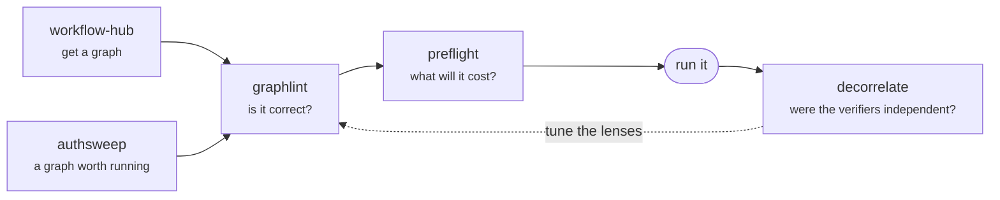

  
  <h3>Linear execution is a chain. The work is actually a graph. These are the tools that make that affordable.</h3>
  
<strong><a href="https://unchained-labs.github.io/">unchained-labs.github.io</a></strong>

  

    <a href="https://unchained-labs.github.io/graphlint/">graphlint</a> ·
    <a href="https://unchained-labs.github.io/preflight/">preflight</a> ·
    <a href="https://unchained-labs.github.io/decorrelate/">decorrelate</a> ·
    <a href="https://unchained-labs.github.io/authsweep/">authsweep</a> ·
    <a href="https://unchained-labs.github.io/workflow-hub/">workflow-hub</a>
  

  
   <code>graphlint</code> — real output, 16 rules, zero tokens.
  <a href="https://unchained-labs.github.io/">Every tool has a demo on the landing page →</a>

---

**Infrastructure for agent graphs.** Running many agents in parallel is a
capability most people now have. Running them *affordably and correctly* is a
systems problem, and it is mostly unbuilt: nothing prices a workflow before it
runs, nothing checks whether your verifiers are independent, nothing lints the
spec for the handful of mistakes that everyone makes.

That gap is what this org is for.

## The tools

| | What it does | Docs | Status |
| :--- | :--- | :--- | :--- |
| **[graphlint](https://github.com/Unchained-Labs/graphlint)** | Static analyzer for agent workflow specs. Catches barrier misuse, correlated verifiers, missing schemas and non-terminating cycles — before a token is spent. 16 rules, SARIF output. | [site](https://unchained-labs.github.io/graphlint/) · [demo](https://github.com/Unchained-Labs/graphlint#readme) | `alpha` |
| **[preflight](https://github.com/Unchained-Labs/preflight)** | Prices a workflow before it runs and comments the predicted agent count and dollar cost on the PR that changed it. Dependabot, but for agent spend. | [site](https://unchained-labs.github.io/preflight/) · [demo](https://github.com/Unchained-Labs/preflight#readme) | `alpha` |
| **[decorrelate](https://github.com/Unchained-Labs/decorrelate)** | Measures whether your verifiers are actually independent. Three skeptics sharing a model and a prompt are one check at 3× the price — this puts a number on it. | [site](https://unchained-labs.github.io/decorrelate/) · [demo](https://github.com/Unchained-Labs/decorrelate#readme) | `alpha` |
| **[authsweep](https://github.com/Unchained-Labs/authsweep)** | Finds route handlers with no authorization check. Deterministic, zero tokens, evidence on every finding. | [site](https://unchained-labs.github.io/authsweep/) · [demo](https://github.com/Unchained-Labs/authsweep#readme) | `alpha` |
| **[workflow-hub](https://github.com/Unchained-Labs/workflow-hub)** | Six agent workflows worth copying, one per shape. You own the file after it lands. | [site](https://unchained-labs.github.io/workflow-hub/) · [demo](https://github.com/Unchained-Labs/workflow-hub#readme) | `alpha` |
| **[branding](https://github.com/Unchained-Labs/branding)** | The brand system. Measured contrast, computed geometry, tested docs. | [site](https://unchained-labs.github.io/branding/) · [demo](https://github.com/Unchained-Labs/branding#readme) | `v1` |

Everything is MIT, alpha, and honest about it. Pin exact versions.

## How they fit together

Four stages, and each answers a question you currently cannot answer:

- **Before you write it** — start from a graph that already works.
- **Before you merge it** — does it contain the mistakes everyone makes?
- **Before you run it** — what is this going to cost, and which stage dominates?
- **After you run it** — did the verification you paid for actually buy anything?

The family is self-consistent, and that is enforced rather than claimed:
`authsweep` emits a verify graph that `graphlint` lints clean and `preflight`
prices, and every workflow in `workflow-hub` passes `graphlint` with zero
findings. CI fails if any of that stops being true.

## The argument, in six lines

1. **An edge is data moving, not order.** Most "and then" in an agent script
   carries nothing and is pure wasted latency.
2. **The plan lives in code you own; the judgment lives in the model.** Anything a
   model decides that could have been code is a reliability bug you chose to ship.
3. **Reduce steps are free.** Spawning an agent to "combine the results" is
   `flatMap` and a `Set` — deterministic, instant, zero tokens.
4. **Stream by default.** A barrier makes everything wait for the slowest node.
   Use one only for a true cross-set dependency, and write the reason down.
5. **Verification is usually the biggest line item**, and it is findings × lenses,
   not fan-out width. Everyone sizes the wrong term.
6. **N identical verifiers are one verifier counted N times.** Vary the lens, vary
   the model, or use an executable oracle.

Each tool enforces a subset of that mechanically, so it stops being advice.

## Everything is deployed

Every repo has a docs site on GitHub Pages and a terminal demo built from real CLI
output. The [landing page](https://unchained-labs.github.io/) collects all of them
alongside the pipeline diagram and the argument each tool enforces.

## Also here

Voice-first orchestration, from before this org's focus narrowed —
[Kymatics](https://github.com/Unchained-Labs/kymatics) (the umbrella),
[Otter](https://github.com/Unchained-Labs/otter) (Rust orchestration engine),
[Lavoix](https://github.com/Unchained-Labs/lavoix) (STT/TTS service) and
[Seal](https://github.com/Unchained-Labs/seal) (the frontend).

## Contributing

Issues and PRs welcome on any repo. Read
[CONTRIBUTING.md](https://github.com/Unchained-Labs/.github/blob/main/CONTRIBUTING.md)
first — the short version is that every finding needs evidence, every number
needs a measurement, and a new rule needs a fixture that fails without it.

Security reports: [SECURITY.md](https://github.com/Unchained-Labs/.github/blob/main/SECURITY.md).

  <a href="https://unchained-labs.github.io/">Landing</a> ·
  <a href="https://unchained-labs.github.io/branding/">Brand</a> ·
  Built by <a href="https://github.com/guilyx">Erwin Lejeune</a> ·
  MIT

